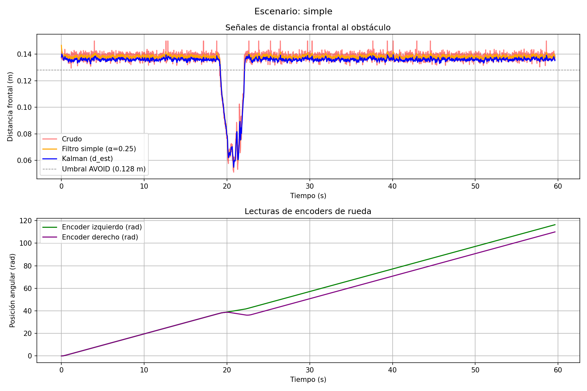
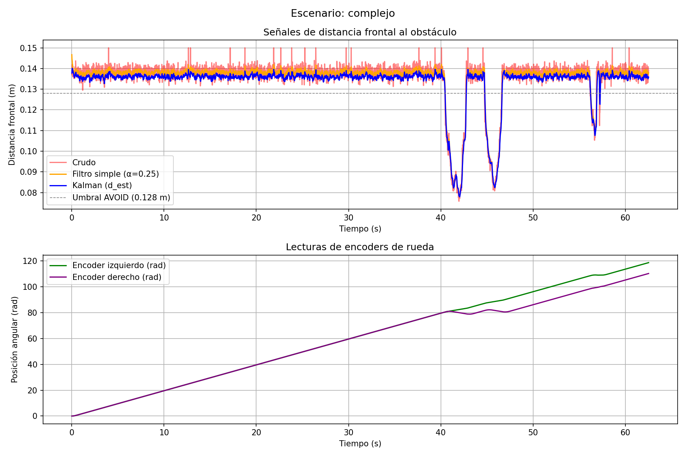

# Laboratorio 2: Navegación reactiva con filtrado y fusión de sensores en Webots

**Curso:** Robótica y Sistemas Autónomos 2026-01 — ICI 4150

**Integrantes:**
- Maria Paganetti
- Ignacia Brahim
- Diego Alvarado
- Sean Jamen
- Ariel Villar

---

## Objetivo

Implementar un sistema de navegación reactiva en Webots para un robot móvil diferencial, utilizando sensores de distancia y encoders de rueda, aplicando filtrado sobre las mediciones y empleando un filtro de Kalman para estimar la distancia frontal a obstáculos y mejorar la toma de decisiones.

---

## Robot y sensores utilizados

**Robot:** e-puck (diferencial de dos ruedas independientes)
- Radio de rueda: `r = 0.0205 m`
- Diámetro del robot: `~7.4 cm`

**Sensores de distancia (infrarrojo):**

| Sensor | Posición |
|--------|----------|
| ps0, ps1 | Frontales derechos |
| ps6, ps7 | Frontales izquierdos |
| ps2 | Lateral izquierdo |
| ps5 | Lateral derecho |

**Encoders:** `left wheel sensor` y `right wheel sensor` — entregan posición angular acumulada en radianes.

---

## Frecuencia de muestreo

El controlador se ejecuta cada paso de simulación definido por `basicTimeStep`:

$$T_s = 16 \text{ ms} \qquad f_s = \frac{1}{T_s} = 62.5 \text{ Hz}$$

Todas las señales (crudas, filtradas y estimadas) se registran a esta frecuencia.

---

## Análisis de señales registradas

Los sensores infrarrojos del e-puck entregan valores crudos en escala no lineal (0–4095). Para obtener distancias en metros se aplica la función de mapeo:

$$d = \frac{1.16}{\sqrt{v_{crudo}}} \quad \text{con } v_{crudo} \geq 65, \quad d \in [0.01,\ 0.15] \text{ m}$$

Si `v_crudo < 65` (sin obstáculo detectable) se retorna el valor máximo `0.15 m`. La señal cruda presenta ruido considerable, especialmente durante giros y cuando el robot enfrenta superficies en ángulo.

---

## Estimación del avance mediante encoders

Los encoders entregan desplazamiento angular $\theta$ en radianes. El avance lineal de cada rueda se calcula como:

$$s = r \cdot \theta$$

El avance promedio del robot entre dos instantes consecutivos:

$$\Delta d_k = \frac{s_{izq} + s_{der}}{2}$$

Este valor alimenta la etapa de predicción del filtro de Kalman.

---

## Filtro simple aplicado

Se aplica un filtro exponencial de paso bajo sobre la lectura frontal máxima convertida a metros:

$$z_k = \alpha \cdot z_{k,\text{crudo}} + (1 - \alpha) \cdot z_{k-1} \qquad \alpha = 0.25$$

Un $\alpha$ bajo suaviza más el ruido pero introduce mayor retardo ante cambios bruscos de distancia.

---

## Implementación del filtro de Kalman

El filtro de Kalman estima la distancia frontal $\hat{d}_k$ combinando la predicción por odometría con la medición directa del sensor.

### Etapa de predicción

$$\hat{d}_k^- = \hat{d}_{k-1} - \Delta d_k \qquad P_k^- = P_{k-1} + Q \qquad (Q = 0.005)$$

### Etapa de corrección

$$K_k = \frac{P_k^-}{P_k^- + R} \qquad (R = 0.07)$$

$$\hat{d}_k = \hat{d}_k^- + K_k\left(z_{k,\text{crudo}} - \hat{d}_k^-\right)$$

$$P_k = (1 - K_k)\cdot P_k^-$$

La corrección usa $z_{k,\text{crudo}}$ (medición directa del sensor, ruidosa), independiente del filtro simple. La ganancia $K_k$ pondera automáticamente cuánto confiar en la predicción versus la medición en cada instante: si $R$ es grande, el filtro confía más en la predicción; si $P_k^-$ es grande, confía más en el sensor.

---

## Lógica de navegación reactiva

El robot opera con tres estados basados en `d_est` (estimación Kalman):

| Estado | Condición de entrada | Acción |
|--------|---------------------|--------|
| `FORWARD` | `d_est > 0.133 m` | Avanza a 2.0 rad/s |
| `FRENANDO` | `d_est < 0.128 m` | Detiene motores por 240 ms (15 pasos × 16 ms) |
| `AVOID` | Fin del frenado | Gira en el lugar a 1.2 rad/s |

**Dirección del giro** (decidida con sensores laterales):
- `max(ps0, ps1) > max(ps6, ps7)` → obstáculo más próximo por la derecha → gira a la izquierda
- caso contrario → obstáculo más próximo por la izquierda → gira a la derecha

---

## Gráficos de señales

### Escenario simple


### Escenario complejo


---

## Escenarios de prueba

### Escenario 1 — Simple (`escenario_simple.wbt`)

Arena de 2.5×2.5 m con 3 obstáculos aislados. El robot parte desde (-0.9, 0) mirando hacia +x.

- Obstáculo central en (0, 0)
- Obstáculo superior en (0.7, 0.5)
- Obstáculo inferior en (0.5, -0.7)

Se observa un único evento de esquive, con las señales cruda, filtrada y Kalman claramente diferenciadas en el valle del gráfico.

### Escenario 2 — Complejo (`escenario_complejo.wbt`)

Pasillo en L de 0.30 m de ancho formado por 4 paredes, más 3 obstáculos dispersos. El robot debe navegar por el tramo horizontal, detectar el fondo del pasillo y girar para recorrer el tramo vertical.

Se observan múltiples eventos de esquive y una divergencia notable entre los encoders izquierdo y derecho, lo que evidencia los giros realizados dentro del pasillo. La estimación Kalman se mantiene más estable que la señal cruda en todos los eventos.

---

## Análisis y conclusiones

- El **filtro simple** reduce el ruido de alta frecuencia pero introduce retardo ante cambios bruscos, lo que puede provocar reacciones tardías frente a obstáculos próximos.
- El **filtro de Kalman** combina la predicción odométrica con la medición del sensor, produciendo una estimación más estable y con menor retardo cuando el robot avanza en línea recta.
- Usar `d_est` en lugar de lecturas crudas para las decisiones de navegación reduce los giros innecesarios causados por picos de ruido transitorio.
- En el escenario complejo, los encoders divergen visiblemente durante los giros dentro del pasillo, lo que aumenta la incertidumbre de la predicción y hace que la ganancia $K_k$ suba, confiando más en el sensor.

---

## Instrucciones para ejecutar

**Requisitos:** Webots R2025a, Python 3 con `matplotlib`

1. Abrir Webots: `File → Open World` y seleccionar el escenario deseado:
   - `worlds/escenario_simple.wbt`
   - `worlds/escenario_complejo.wbt`

2. Correr la simulación (▶). Se genera `docs/datos_simulacion.csv` automáticamente.

3. Detener la simulación y desde la raíz del repositorio ejecutar:
   ```bash
   python graficar.py simple
   # o
   python graficar.py complejo
   ```
   Genera el PNG correspondiente en `docs/`.
