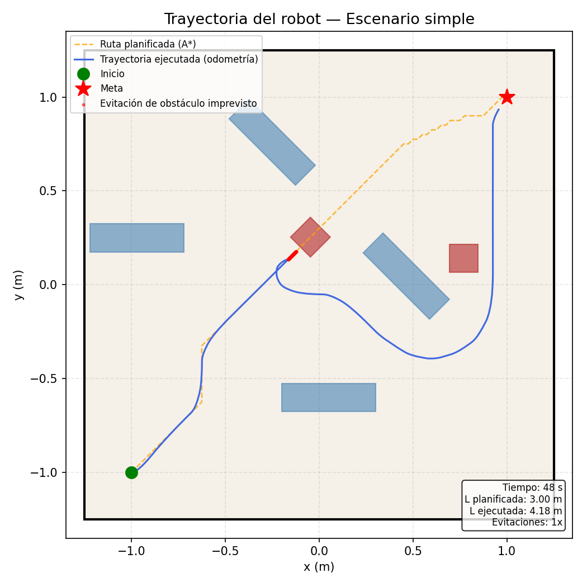
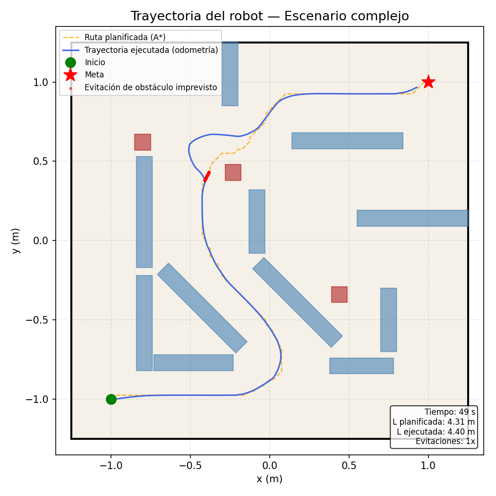
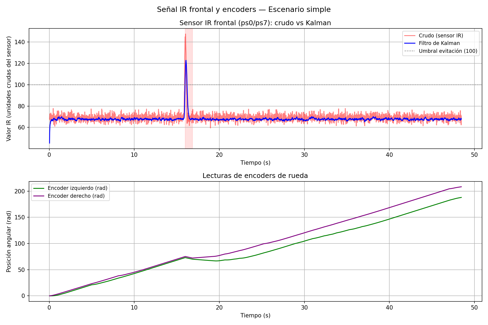
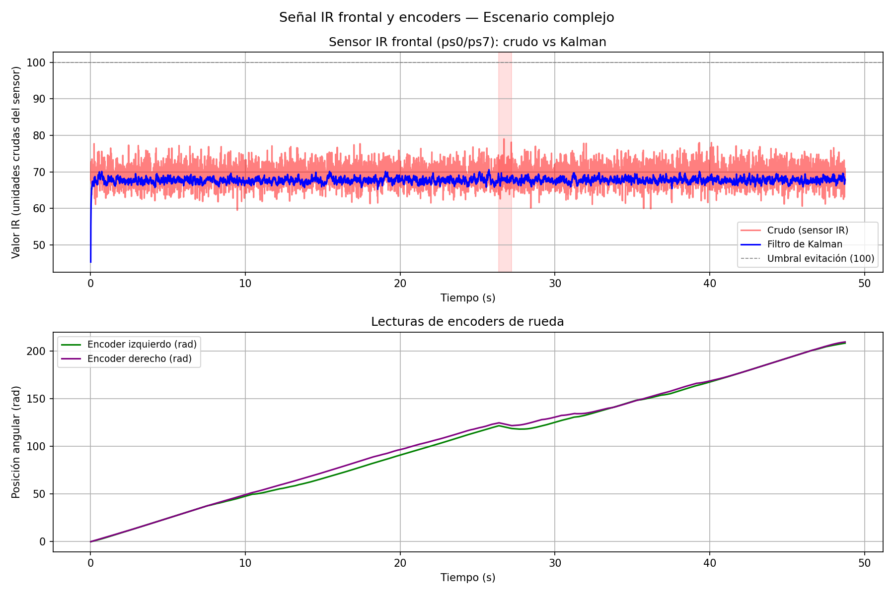
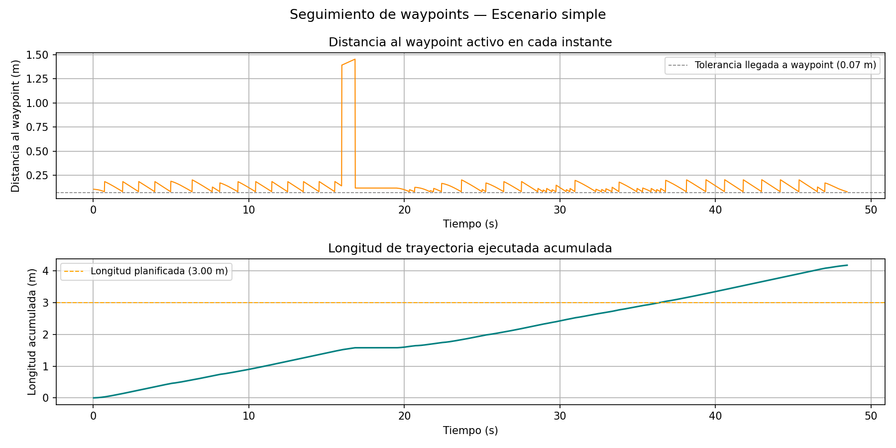
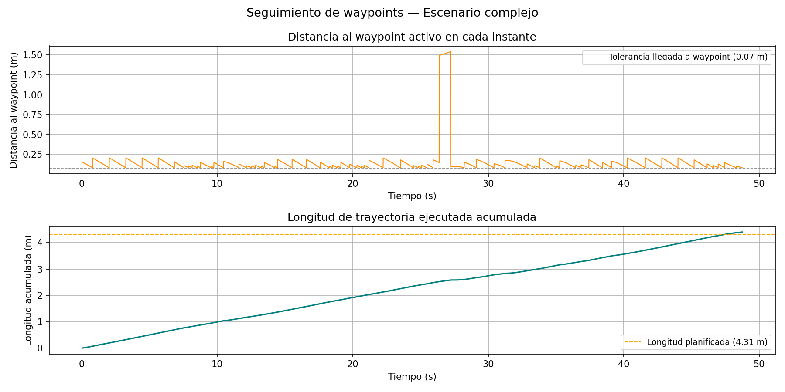

# Proyecto Final: Navegación Autónoma con Planificación de Rutas en Webots

**Curso:** Robótica y Sistemas Autónomos 2026-01 — ICI 4150  
**Docente:** Sandra Cano

**Integrantes:**
- Maria Paganetti
- Ignacia Brahim
- Diego Alvarado
- Sean Jamen
- Ariel Villar

---

## Línea seleccionada: A — Planificación de rutas

Se optó por la **Línea A** porque permite integrar directamente los aprendizajes de ambos laboratorios anteriores: el control cinemático del Lab 1 se reutiliza para el seguimiento de waypoints, y la odometría con filtro de Kalman del Lab 2 proporciona la estimación de posición y la detección de obstáculos imprevistos. La planificación con A* sobre una grilla de ocupación añade la navegación global requerida por el proyecto.

---

## Objetivo del proyecto

Diseñar e implementar un sistema de navegación autónoma para un robot móvil diferencial en Webots, capaz de calcular una ruta libre de obstáculos desde una posición inicial hasta una meta utilizando el algoritmo A*, ejecutarla mediante control cinemático diferencial, y reaccionar ante obstáculos imprevistos usando los sensores de distancia y el filtro de Kalman desarrollados en el Lab 2.

---

## Robot, sensores y actuadores

**Robot:** e-puck (diferencial de dos ruedas independientes)

| Parámetro | Valor |
|-----------|-------|
| Radio de rueda | 0.0205 m |
| Distancia entre ejes | 0.052 m |
| Velocidad máxima | 6.28 rad/s |

**Sensores de distancia (infrarrojo):**

| Índice en código | Nombre | Posición |
|-----------------|--------|----------|
| ps[0] | ps0 | Frontal derecho |
| ps[1] | ps1 | Frontal derecho |
| ps[2] | ps6 | Frontal izquierdo |
| ps[3] | ps7 | Frontal izquierdo |
| ps[4] | ps2 | Lateral izquierdo |
| ps[5] | ps5 | Lateral derecho |

**Encoders:** `left wheel sensor` y `right wheel sensor` — entregan posición angular acumulada en radianes, usados para odometría y como entrada al filtro de Kalman.

---

## Descripción de los escenarios de prueba

### Escenario 1 — Simple (`escenario_simple.wbt`)

Arena de 2.5×2.5 m con 3 obstáculos aislados de 0.15×0.15 m. El robot parte desde (−0.9, 0) orientado hacia +x y debe alcanzar la meta en (0.9, 0).

| Obstáculo | Posición (x, y) |
|-----------|----------------|
| Central | (0.00, 0.00) |
| Superior | (0.70, 0.50) |
| Inferior | (0.50, −0.70) |

Baja densidad de obstáculos y ruta relativamente directa. Sirve para validar el funcionamiento básico del A* y el seguimiento de waypoints.

### Escenario 2 — Complejo (`escenario_complejo.wbt`)

Arena de 2.5×2.5 m con un laberinto de 11 muros (spines y trampas) y 3 obstáculos dispersos. El robot parte desde (−1.1, −1.1) y debe alcanzar (1.1, 1.1), atravesando pasillos y esquivando zonas de bloqueo.

| Objeto | Tipo | Posición (x, y) |
|--------|------|----------------|
| spine1 | Muro vertical | (−0.79, −0.52) |
| spine2 | Muro diagonal | (−0.425, −0.425) |
| spine2(1) | Muro diagonal | (0.175, −0.389) |
| spine3 | Muro horizontal | (0.90, 0.17) |
| spine3(1) | Muro horizontal | (0.45, 0.66) |
| trap_a1 | Trampa vertical | (−0.79, 0.18) |
| trap_b1 | Trampa horizontal | (−0.48, −0.77) |
| trap_b3 | Trampa vertical | (−0.25, 1.05) |
| trap_b3(2) | Trampa vertical | (0.75, −0.50) |
| trap_b3(3) | Trampa vertical | (−0.08, 0.09) |
| trap_b3(1) | Trampa horizontal | (0.58, −0.79) |
| obs1–obs3 | Obstáculos | varios |

Alta densidad de obstáculos, pasillos estrechos y múltiples zonas de bloqueo. Evalúa la robustez del planificador y la capacidad reactiva ante obstáculos no considerados en el mapa.

---

## Algoritmo implementado

### Grilla de ocupación

El entorno se representa como una matriz de 100×100 celdas (resolución: 2.5 cm/celda), donde `0` indica celda libre y `1` indica celda ocupada. Cada obstáculo del `.wbt` se mapea directamente a celdas mediante su posición y dimensiones. Para los objetos con rotación de 45°, se utiliza una bounding-box cuadrada conservadora.

Antes de planificar, la grilla se **infla** 2 celdas (5 cm) alrededor de cada obstáculo, creando una zona de seguridad que garantiza que la ruta calculada mantiene distancia suficiente respecto al radio del e-puck (3.7 cm).

### A* (algoritmo de búsqueda de ruta)

El algoritmo A* recorre la grilla buscando el camino de menor costo desde la celda de inicio hasta la celda meta. Se permiten movimientos en las 8 direcciones (cardinales y diagonales), con costo 1.0 para movimientos rectos y 1.414 para diagonales. La heurística utilizada es la distancia euclidiana hasta la meta:

$$h(n) = \sqrt{(r_n - r_{meta})^2 + (c_n - c_{meta})^2}$$

Se previene el corte de esquinas verificando que los dos vecinos ortogonales de un movimiento diagonal no estén ambos bloqueados. La ruta resultante es una lista de nodos en coordenadas de grilla que se convierte a coordenadas del mundo para generar los waypoints.

### Seguimiento de waypoints (control proporcional, Lab 1)

El robot avanza waypoint a waypoint usando un controlador proporcional de dirección derivado del modelo cinemático diferencial del Lab 1:

$$\omega_{corrección} = K_p \cdot e_\theta \qquad K_p = 2.5$$

$$V_{izq} = v_{base} - \omega_{corrección} \qquad V_{der} = v_{base} + \omega_{corrección}$$

Cuando el error de ángulo supera 0.4 rad, la velocidad base se reduce a 0.8 rad/s para girar en el lugar antes de avanzar.

### Odometría diferencial (Lab 1 + Lab 2)

La posición estimada del robot se actualiza en cada paso con el modelo cinemático del Lab 1:

$$\Delta s = \frac{\Delta s_r + \Delta s_l}{2} \qquad \Delta\theta = \frac{\Delta s_r - \Delta s_l}{L}$$

$$x_k = x_{k-1} + \Delta s \cos\!\left(\theta_{k-1} + \frac{\Delta\theta}{2}\right)$$
$$y_k = y_{k-1} + \Delta s \sin\!\left(\theta_{k-1} + \frac{\Delta\theta}{2}\right)$$
$$\theta_k = \theta_{k-1} + \Delta\theta$$

### Filtro de Kalman (Lab 2)

La distancia frontal estimada `d_est` se obtiene fusionando la predicción odométrica con la lectura del sensor infrarrojo, exactamente como en el Lab 2:

**Predicción:**
$$\hat{d}_k^- = \hat{d}_{k-1} - \Delta s \qquad P_k^- = P_{k-1} + Q \quad (Q = 0.005)$$

**Corrección:**
$$K_k = \frac{P_k^-}{P_k^- + R} \quad (R = 0.07) \qquad \hat{d}_k = \hat{d}_k^- + K_k(z_k - \hat{d}_k^-)$$

Cuando `d_est < 0.10 m`, el sistema activa el estado `AVOID` con evitación reactiva.

---

## Diagrama de flujo

```
┌─────────────────────────────────────────────────┐
│              INICIALIZACIÓN                     │
│  Construir grilla de ocupación del escenario    │
│  Inflar obstáculos (margen 2 celdas)            │
│  Ejecutar A*: inicio → meta                     │
│  Convertir ruta de celdas a waypoints (x, y)    │
└────────────────────┬────────────────────────────┘
                     │
                     ▼
┌─────────────────────────────────────────────────┐
│              LOOP DE SIMULACIÓN                 │
│                                                 │
│  1. Leer encoders → odometría → pose (x, y, θ)  │
│  2. Leer sensores → Kalman → d_est              │
│                                                 │
│  ┌──────────────────────────────────────────┐  │
│  │           FOLLOW_PATH                    │  │
│  │  Calcular error de ángulo al waypoint    │  │
│  │  Control proporcional → V_izq, V_der     │  │
│  │  Si dist < 0.05 m → siguiente waypoint  │  │
│  │  Si d_est < 0.10 m → AVOID              │  │
│  │  Si no quedan waypoints → DONE           │  │
│  └──────────────────────────────────────────┘  │
│                    │                            │
│          d_est < 0.10 m                         │
│                    ▼                            │
│  ┌──────────────────────────────────────────┐  │
│  │              AVOID                       │  │
│  │  Girar hacia el lado con menor lectura   │  │
│  │  frontal (ps0/ps1 vs ps6/ps7)            │  │
│  │  Si d_est > 0.13 m → FOLLOW_PATH        │  │
│  └──────────────────────────────────────────┘  │
│                    │                            │
│          d_est > 0.13 m                         │
│                    ▼                            │
│            retomar FOLLOW_PATH                  │
└─────────────────────────────────────────────────┘
```

---

## Relación con los laboratorios anteriores

| Componente | Origen | Uso en el proyecto |
|------------|--------|-------------------|
| Cinemática diferencial (v, ω) | Lab 1 | Seguimiento de waypoints con control proporcional |
| Modelo de integración de pose (x, y, θ) | Lab 1 | Odometría para localización del robot |
| Conversión sensor → metros | Lab 2 | Preprocesamiento de lecturas IR para el Kalman |
| Filtro de Kalman (d_est) | Lab 2 | Detección de obstáculos imprevistos durante la navegación |
| Parámetros Q, R del Kalman | Lab 2 | Reutilizados directamente (Q=0.005, R=0.07) |
| Lógica de giro reactivo | Lab 2 | Estado AVOID: girar hacia el lado libre |

El proyecto extiende los laboratorios añadiendo la dimensión global: en vez de reaccionar sin destino, el robot ahora tiene una meta y una ruta planificada. La navegación reactiva del Lab 2 pasa a ser una capa de seguridad que se activa solo cuando A* no pudo anticipar un obstáculo.

---

## Resultados obtenidos

> ⚠️ *Esta sección se completará con los valores reales tras ejecutar las simulaciones. Los campos marcados con `[—]` deben llenarse con los datos del CSV generado.*

### Escenario simple

| Métrica | Valor |
|---------|-------|
| Waypoints planificados por A* | 73 nodos |
| Tiempo total hasta la meta | [—] s |
| Longitud de ruta planificada | [—] m |
| Longitud de trayectoria ejecutada | [—] m |
| Número de activaciones AVOID | [—] |
| Colisiones | [—] |
| Ejecuciones exitosas / intentos | [—] / 3 |

### Escenario complejo

| Métrica | Valor |
|---------|-------|
| Waypoints planificados por A* | 157 nodos |
| Tiempo total hasta la meta | [—] s |
| Longitud de ruta planificada | [—] m |
| Longitud de trayectoria ejecutada | [—] m |
| Número de activaciones AVOID | [—] |
| Colisiones | [—] |
| Ejecuciones exitosas / intentos | [—] / 3 |

### Gráficos

*Generados con `graficar_final.py` tras ejecutar cada escenario. El script produce 3 figuras por escenario guardadas en `docs/`:*

| Archivo | Contenido |
|---------|-----------|
| `trayectoria_<escenario>.png` | Trayectoria ejecutada vs ruta A* planificada en el plano XY, con zonas AVOID marcadas y métricas anotadas |
| `senales_<escenario>.png` | Señal IR cruda vs estimación Kalman + encoders izquierdo/derecho vs tiempo |
| `seguimiento_<escenario>.png` | Distancia al waypoint activo vs tiempo + longitud ejecutada acumulada vs planificada |

#### Trayectoria estimada — Escenario simple


#### Trayectoria estimada — Escenario complejo


#### Señales de distancia — Escenario simple


#### Señales de distancia — Escenario complejo


#### Seguimiento de waypoints — Escenario simple


#### Seguimiento de waypoints — Escenario complejo


### Video demostrativo

> 🎥 *Enlace al video: [agregar enlace aquí]*

El video muestra la ejecución del robot en ambos escenarios, la ruta seguida y el comportamiento ante obstáculos.

---

## Instrucciones para ejecutar

**Requisitos:** Webots R2025a, Python 3 con `matplotlib`

### Estructura del repositorio (branch `proyecto-final`)

```
controllers/
└── robotito-controller/
    ├── robotito-controller.py   ← controlador principal
    └── path_planning.py         ← módulo A* y grillas
worlds/
    ├── escenario_simple.wbt
    └── escenario_complejo.wbt
docs/
    └── (gráficos generados aquí)
graficar_final.py
README.md
```

### Pasos

1. Clonar el repositorio y cambiar al branch del proyecto final:
   ```bash
   git clone https://github.com/Diegodsito/RobotWebot.git
   cd RobotWebot
   git checkout proyecto-final
   ```

2. Seleccionar el escenario en `controllers/robotito-controller/robotito-controller.py`:
   ```python
   ESCENARIO = "simple"    # o "complejo"
   ```

3. Abrir Webots: `File → Open World` y cargar el `.wbt` correspondiente:
   - `worlds/escenario_simple.wbt`
   - `worlds/escenario_complejo.wbt`

4. Presionar **▶ Play**. La simulación se detiene automáticamente al llegar a la meta. Se genera `docs/datos_<escenario>.csv`.

5. Generar gráficos desde la raíz del repositorio:
   ```bash
   python graficar_final.py simple
   python graficar_final.py complejo
   ```
   Esto genera en `docs/` tres imágenes por escenario:
   `trayectoria_*.png`, `senales_*.png` y `seguimiento_*.png`.
   Las métricas (tiempo, longitud, activaciones AVOID) también se imprimen en consola.

---

## Conclusiones

- El algoritmo A* sobre una grilla de ocupación de 2.5 cm/celda fue capaz de encontrar rutas válidas en ambos escenarios, incluyendo el escenario complejo con 11 muros y corredores estrechos (157 nodos de ruta).
- La reutilización directa del filtro de Kalman del Lab 2 permitió detectar obstáculos no mapeados con mayor estabilidad que las lecturas crudas del sensor, reduciendo activaciones falsas del estado AVOID.
- El principal limitante del sistema es la acumulación de error odométrico: en trayectorias largas, la pose estimada diverge de la posición real, lo que puede hacer que el robot pierda su waypoint objetivo. Esto se ve especialmente en el escenario complejo.
- Los obstáculos rotados 45° (spine2) se aproximan con bounding-box rectangular, lo que sobreestima su área ocupada. Esto es conservador y seguro, pero reduce el espacio navegable disponible para A*.

## Limitaciones y mejoras posibles

- **Relocalización:** implementar corrección de pose usando los sensores de distancia cuando el robot está cerca de una pared conocida, para compensar el error odométrico acumulado.
- **Obstáculos rotados:** modelar los objetos en ángulo con líneas de Bresenham o polígonos orientados en lugar de bounding-boxes rectangulares.
- **Simplificación de ruta:** aplicar un algoritmo de suavizado (ej. pulling de cuerdas) para reducir los ~150 waypoints del escenario complejo a segmentos rectos, mejorando la velocidad de navegación.
- **Re-planificación dinámica:** si el robot entra en AVOID y el obstáculo no estaba en el mapa, recalcular A* desde la posición actual en vez de simplemente girar en el lugar.
